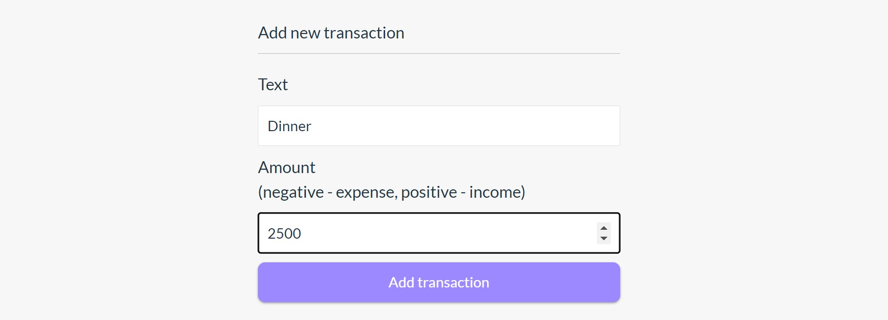
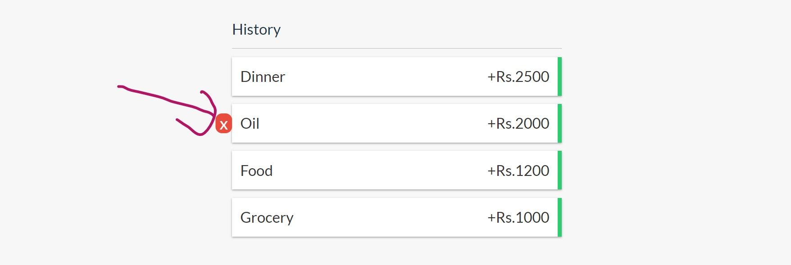
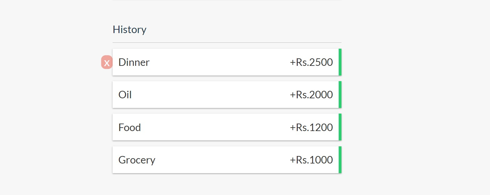

💰Expenses is a [progressive web application](https://developers.google.com/web/progressive-web-apps/) on top of [Google Sheets](https://developers.google.com/sheets/) 📉 written in [React](https://facebook.github.io/react/) ⚛️. It is only a static HTML that works great on mobile 📱 and can be deployed anywhere.

Check out the [demo](https://incometrackers.netlify.app/) but please be considerate and don't break it for others.


[Home](doc/home.jpg)


It was inspired by the [expense-manager] it uses the [Vite](https://vite.dev/) , [Tailwind Css](https://tailwindcss.com/),and [Context Api](https://legacy.reactjs.org/docs/context.html)

## Features

* Add Your Income
  * Checking, Histoy.
* Delete Your Expense
  * Progressive Web App. Loads quickly and works as a standalone app.
* Beautiful and simple design
  * Better than native ;)

## Technologies

* React
  
* Context Api
  
* Tailwind CSS
  


## Get started

You will need a somewhat recent version of [Node](https://nodejs.org/en/) and a place to deploy static HTML under a custom domain (doesn't have to be top level). To get the full offline support with service workers you'll need HTTPS – [CloudFlare](cloudflare.com) works fine or you can use your own certificate.


```
npm create vite@latest
```

2) copy the content of `build` folder to your server

### Head

Header Of Expense Tracker .


### Adding Expenses

You can Add Your expenses .



### Delete Your Expenses

After AddingYour Expenses , You can Delete Your Expenses .



### Check History Of Your Expenses

After AddingYour Expenses , You can Check Your Expenses .

---

If you like this project – you might also enjoy [React Digest](https://reactdigest.net/) newsletter 🗞. Subscribe to get the top 5 news from React community every week.
